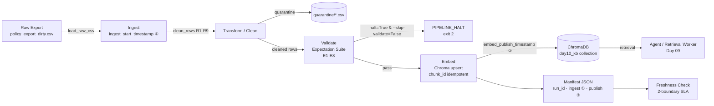

# Kiến trúc pipeline — Lab Day 10

**Nhóm:** AI in Action — C401 D4  
**Cập nhật:** 2026-04-15

---

## 1. Sơ đồ luồng



**Điểm đo freshness:**
- **① ingest_start_timestamp** — khi `load_raw_csv` bắt đầu (boundary ingest)
- **② embed_publish_timestamp** — khi `col.upsert()` hoàn tất (boundary publish)

**Quarantine:** file `artifacts/quarantine/quarantine_<run_id>.csv` — không bị embed, không bị drop silently, có `reason` field để audit.

---

## 2. Ranh giới trách nhiệm

| Thành phần | Input | Output | Owner nhóm |
|------------|-------|--------|------------|
| **Ingest** | `data/raw/policy_export_dirty.csv` | `List[Dict]` rows + `ingest_start_timestamp` | Ingestion Owner |
| **Transform** | raw rows | cleaned rows + quarantine rows | Cleaning/Quality Owner |
| **Quality** | cleaned rows | `List[ExpectationResult]` + `should_halt` | Cleaning/Quality Owner |
| **Embed** | cleaned CSV | Chroma upsert + `embed_publish_timestamp` | Embed Owner |
| **Monitor** | manifest JSON | freshness PASS/WARN/FAIL (2 boundary) | Monitoring/Docs Owner |

---

## 3. Idempotency & rerun

Pipeline sử dụng **upsert theo `chunk_id` ổn định**:

```
chunk_id = f"{doc_id}_{seq}_{sha256(doc_id|chunk_text|seq)[:16]}"
```

- **Rerun 2 lần**: Chroma `upsert` không tạo duplicate — đếm collection không đổi.
- **Prune id thừa**: Trước mỗi upsert, pipeline lấy tất cả `prev_ids` trong collection, tính `drop = prev_ids - current_ids` và xóa. Tránh "mồi cũ" trong top-k làm fail grading.
- **Log `embed_prune_removed`**: Lần rerun đầu tiên sau inject bad → số này > 0, xác nhận prune hoạt động.

**Chứng minh idempotency**: Chạy `python etl_pipeline.py run` hai lần liên tiếp → `embed_upsert count` bằng nhau, `embed_prune_removed=0` ở lần 2.

---

## 4. Liên hệ Day 09

- **Day 09** dùng collection `day09_kb` (hoặc `helpdesk_kb`) trong `day09/lab/`.
- **Day 10** tạo collection `day10_kb` từ cùng domain (CS + IT Helpdesk) nhưng qua pipeline có quality gate.
- Sau khi Day 10 pipeline chạy sạch, `retrieval_worker` Day 09 có thể trỏ sang `day10_kb` để hưởng corpus đã clean — chỉ cần đổi `CHROMA_COLLECTION` env var.
- Cùng embedding model `all-MiniLM-L6-v2` → compatible vector space.

---

## 5. Rủi ro đã biết

- `exported_at` trong CSV mẫu là `2026-04-10T08:00:00` → freshness_check **FAIL** trên SLA 24h (data cũ 5 ngày). Đây là hành vi cố ý của mẫu — giải thích trong runbook.
- Nếu thêm doc_id mới, phải đồng bộ `ALLOWED_DOC_IDS` trong `cleaning_rules.py` **và** `contracts/data_contract.yaml`.
- Chroma local không hỗ trợ blue/green swap — phải dùng 2 collection name nếu muốn zero-downtime publish.
